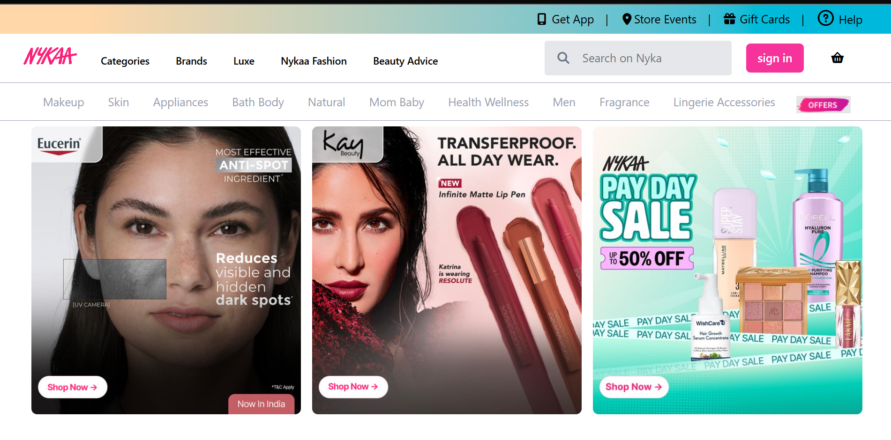

# 🛍️ Nykaa Navbar Clone

A responsive navigation bar inspired by the Nykaa website, built using **HTML**, **Tailwind CSS**, and **Font Awesome**.  
This project demonstrates how to design a modern, gradient-based navigation bar with a search box, icons, and responsive layout behavior for different screen sizes.

---

## 🌟 Features

- **Modern gradient navbar** with brand-like aesthetics  
- **Responsive layout** using Tailwind CSS breakpoints (`sm`, `md`, `lg`)  
- **Integrated Font Awesome icons** for visual enhancement  
- **Functional search box** with placeholder  
- **Hover effects** and transitions for a polished look  
- **Category and sub-navigation bar** for product classification  
- **Optimized for all screen sizes** (mobile, tablet, and desktop)

---

## 🧠 Technologies Used

| Technology | Purpose |
|-------------|----------|
| **HTML5** | Structure of the webpage |
| **Tailwind CSS** | Styling and responsive design |
| **Font Awesome** | Icons for UI elements |
| **JavaScript (optional)** | Can be added later for mobile menu toggle |

---

## 📱 Responsive Design Notes

This project uses Tailwind’s responsive classes such as:

- `hidden md:flex` → hides elements on small screens  
- `flex-col md:flex-row` → changes layout direction  
- `w-full md:w-auto` → adjusts width based on screen size

---

# project screenshot
